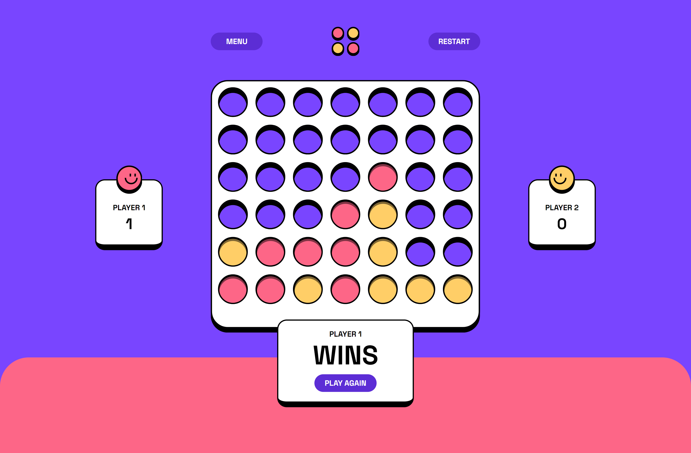

# Connect Four game solution


## Table of contents

- [Overview](#overview)
  - [The challenge](#the-challenge)
  - [Screenshot](#screenshot)
  - [Links](#links)
- [My process](#my-process)
  - [Built with](#built-with)
  - [What I learned](#what-i-learned)
  - [Useful resources](#useful-resources)
- [Author](#author)


## Overview

### The challenge

Users are able to:

- View the game rules
- Play a game of Connect Four against another human player (alternating turns on the same computer)
- View the optimal layout for the interface depending on their device's screen size
- See hover and focus states for all interactive elements on the page
- **Bonus**: See the discs animate into their position when a move is made

### Screenshot



### Links

(To be added)

- Solution URL: [Add solution URL here](https://your-solution-url.com)

- Live Site URL: [https://connect-4-444.vercel.app](https://connect-4-444.vercel.app/)

## My process

### Built with

- Semantic HTML5 markup
- CSS custom properties
- Flexbox
- CSS Grid
- Mobile-first workflow
- [TailwindCSS](https://styled-components.com/) - For styles
- [React](https://reactjs.org/) - JS library
- [Next.js](https://nextjs.org/) - React framework
- [Typescript](https://styled-components.com/) - Strongly typed Javascript


### What I learned

My main reason for choosing this project was to get a better understanding of Typescript and to get experience using it in a different type project, where it could be used when handling different types of logic and conditions that come with building an interactive game like connect 4.

Although, in this project, I ended up learning something I didn't expect to encounter in Javascript, that is Maps!

I remember learning about them when I first was learning Javascript and I quickly forgot about them. Mainly because I haven't had a project that has needed them before this. (I probably have, just used a different solution). 

For this project using Maps offered the perfect solution to my problem when trying to match 4 counters in a row, while keeping track of both axises.

The main advantages of using Maps, instead of normal objects, is they allowed me to create key values that kept their data type and didn't convert them to a string, like in normal objects. By doing this I was able to have the key value as a number and keep track of one axis, while having an array of values tracking the other axis as the value. 

Another reason they were perfect for my solution is that keys also maintain the original key insertion order because when tracking the connect 4 counters, we needed to have the key values created in the correct sequence in order to detect the winner.

Here is a small example of how I used them to help detect four in a row:

```js
  const handleVerticalWinCheck = (
    playerCounterList: ColumnRowTypes[]
  ): boolean => {
    // Group by columnValue for vertical checks
    const columnsMap = new Map<number, number[]>();
    playerCounterList.forEach(({ rowValue, columnValue }) => {
      if (!columnsMap.has(columnValue)) {
        columnsMap.set(columnValue, []);
      }
      columnsMap.get(columnValue)!.push(rowValue);
    });
    // Check vertical win
    for (const rows of columnsMap.values()) {
      if (isConsecutive(rows)) return true;
    }
    return false;
  };
```

### Useful resources

- [Github Discussion](https://github.com/vercel/next.js/discussions/12810) - Help me import a local mp3, which didn't work before hand.

- [Pixabay](https://pixabay.com/sound-effects/search/win/?pagi=2) - Sound effects came from Pixabay

- [MDN Docs](https://developer.mozilla.org/en-US/) - Always a good resource

- [NextJS Docs](https://nextjs.org/docs) - NextJS Documentation

- [Confetti Module](https://github.com/catdad/canvas-confetti) - Good confetti module/library for a confetti effect using the canvas.

- [This Stack overflow solution](https://stackoverflow.com/questions/77962571/resolving-module-parse-failed-error-importing-mp3s-in-nextjs14-ts) - Helped me solve a problem I was having using the mp3 files for sound effects.

## Author

- Website - [Portfolio](https://www.djhwebdevelopment.com/)

- Frontend Mentor - [@David-Henery4](https://www.frontendmentor.io/profile/David-Henery4)

- Linkedin - [David Henery](https://www.linkedin.com/in/david-henery-725458241/)


